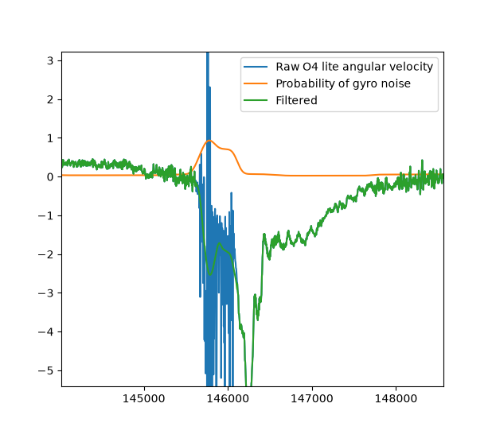

# dji-O4-lite-gyro-fixer

Clean up glitchy or noisy embedded gyro/quaternion telemetry directly inside DJI MP4 files without remuxing the video or touching the underlying media streams.

Some DJI O4 lite air units randomly write corrupted, noisy, or dropped gyro frames into their embedded metadata tracks (`djmd` atoms). This causes camera stabilization algorithms (like Gyroflow) to glitch out, stutter, or warp the image. 

This script parses the binary MP4 container, extracts the embedded `djmd` telemetry payloads using custom Protobuf parsing, filters out high-frequency noise/glitches in angular velocity space, reconstructs a clean quaternion orientation curve via numerical integration, and binary-patches the updated floats straight back into the container.

---

## What It Does

1. **Telemetry Extraction**: Opens an `.mp4` file (via Tkinter file picker) and uses `telemetry_parser` to grab the embedded quaternion metadata stream.
2. **Noise Detection & Adaptive Filtering**:
   - Converts raw orientation quaternions into 3-axis angular velocity ($\omega$).
   - Calculates a per-frame noise probability index using binary phase differences and standard logistic sigmoids.
   - Applies morphological closing (`grey_closing`) and dilation (`grey_dilation`) to bridge dropouts and expand flagged noise regions.
   - Uses a combination of median filtering and Savitzky-Golay filtering (`savgol_filter`) only on high-noise segments while leaving clean data untouched.
3. **Quaternion Reconstruction**: Numerically integrates the cleaned angular velocity vector back into quaternions using `scipy.spatial.transform.Rotation`.
4. **Binary Patching**:
   - Traverses the MP4 atom box structure (`moov` $
ightarrow$ `trak` $
ightarrow$ `mdia` $
ightarrow$ `minf` $
ightarrow$ `stbl`) down to `stsd` / `djmd` tracks.
   - Decodes protobuf structures byte-by-byte to locate the raw IEEE 754 32-bit float values of the original quaternions.
   - Overwrites the inline binary data directly in the buffer and writes a cloned `_gyroFixed.mp4` file without altering file boundaries or size.

---

## Example



*Comparison of raw gyro angular velocity time-series data against the adaptively filtered output.*

---

## Requirements

You'll need Python 3.8+ and the following dependencies:

```bash
pip install numpy scipy tqdm
```

You will also need the third-party `telemetry_parser` module (specifically built for parsing DJI telemetry structures) https://pypi.org/project/telemetry-parser/

---

## Usage

Simply run the main script:

```bash
python main.py
```

1. A native system file selection dialog will pop up. Choose the target `.mp4` file recorded by your DJI device.
2. The script will output processing details to the terminal:
   - Camera model and target metadata sample rate.
   - Number of extracted quaternion chunks and frames.
   - Average and maximum calculated noise probabilities.
   - Progress bars for integration and MP4 atom patching.
3. Once finished, a new file named `<original_filename>_gyroFixed.mp4` will be saved in the same directory.

---

## Configuration

If you need to adjust the filter sensitivity for especially bad footage or softer stabilization requirements, modify the constants at the top of the script:

```python
# Filtering windows
MEDIAN_WINDOW_MS = 250.0  # Window size (ms) for median filter step
SAVGOL_WINDOW_MS = 500.0  # Window size (ms) for Savitzky-Golay filter
SAVGOL_POLYORDER = 5      # Polynomial order for Savitzky-Golay filter
```

---

## Safety & Invariants

* **Non-Destructive**: The original MP4 file is opened strictly read-only. Fixed telemetry is written out to a separate `*_gyroFixed.mp4` file.
* **Stream Preservation**: Video and audio tracks are left byte-for-byte identical. No re-encoding happens, so video quality remains 100% untouched.
* **Size Validation**: The script asserts that the output file size strictly matches the input file size to prevent accidental byte-shift corruption inside the MP4 container format.